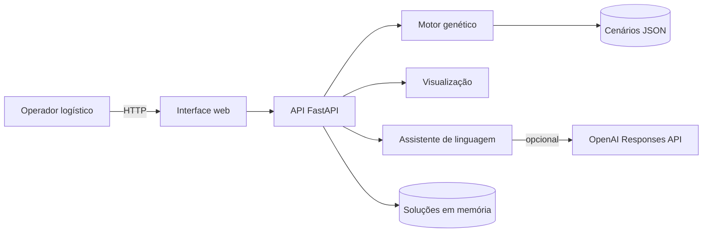
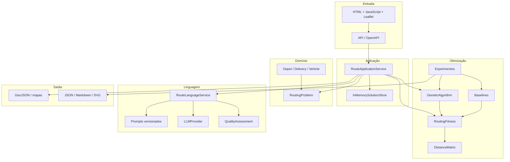
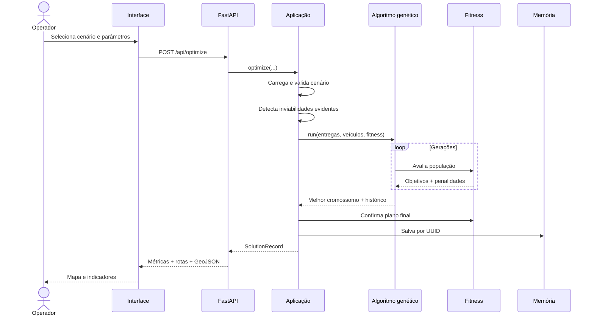
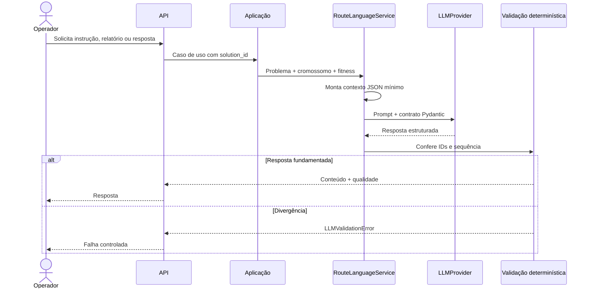

# Arquitetura da solução

## Visão de contexto

O sistema apoia uma equipe logística hospitalar no planejamento de entregas. O
operador seleciona um cenário, configura a otimização, analisa rotas e métricas
e pode solicitar conteúdo em linguagem natural. Serviços externos não participam
do cálculo da solução.



## Componentes



## Fluxo de uma otimização



## Fluxo da LLM



## Dependências entre camadas

As dependências apontam da borda para o núcleo:

```text
api -> application -> domain
                  -> genetic -> domain
                  -> optimization -> domain + genetic
                  -> llm -> domain + optimization
                  -> visualization -> domain + optimization
```

O domínio não importa FastAPI, OpenAI ou bibliotecas de visualização. O motor
genético também não conhece o contexto hospitalar: ele recebe uma função de
custo injetável.

## Decisões arquiteturais

### Cromossomo multirrota imutável

Uma tupla externa representa veículos e cada tupla interna representa a ordem
das entregas. A imutabilidade torna indivíduos seguros para elitismo, comparação
e testes. Entregas duplicadas são rejeitadas na criação.

### Fitness explicável

O custo total é decomposto em objetivo e penalidades. A API pode mostrar
distância, custo, prioridade, carga, autonomia e violações sem recalcular dados.

### Haversine em vez de roteador viário

A primeira versão usa coordenadas e distância de grande círculo, o que mantém a
demonstração determinística e sem serviço externo. As linhas no mapa são
aproximações, não trajetos por ruas.

### LLM fora do caminho crítico

Uma indisponibilidade da LLM não impede calcular rotas. O modelo recebe apenas o
plano final e não participa da função fitness. O provedor local permite testes e
demonstração sem rede.

### Estado em memória

Soluções da API são mantidas em um store protegido por lock. Essa escolha reduz
a infraestrutura da demonstração, mas não oferece persistência após reinício nem
coordenação entre réplicas.

## Escalabilidade e evolução

Para produção, a arquitetura pode evoluir sem alterar o domínio:

- PostgreSQL ou armazenamento de objetos para soluções e relatórios;
- fila de tarefas para otimizações longas;
- serviço de matriz viária com trânsito e janelas de tempo;
- autenticação, autorização e trilha de auditoria;
- cache por cenário e configuração;
- métricas Prometheus e tracing;
- múltiplos depósitos e entregas fracionadas;
- implantação containerizada com múltiplas réplicas.

Implementação em nuvem e infraestrutura como código não fazem parte da versão
atual, conforme a natureza opcional desse item no enunciado.
