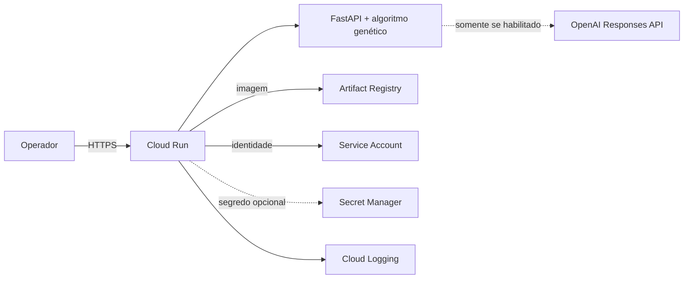

# Implantação opcional no Google Cloud

## Escopo

A aplicação foi preparada para execução containerizada no Google Cloud Run. A
infraestrutura é declarada em Terraform e cobre:

- Artifact Registry para imagens privadas;
- Cloud Run com escala de zero a duas instâncias por padrão;
- conta de serviço exclusiva para o runtime;
- Secret Manager opcional para `OPENAI_API_KEY`;
- probes de inicialização e atividade em `/health`;
- logs de requisição, aplicação e plataforma no Cloud Logging;
- acesso público configurável por IAM.

O provisionamento real não é executado automaticamente pelo repositório, pois
gera recursos faturáveis e exige um projeto Google Cloud sob responsabilidade do
grupo.

## Arquitetura



O Cloud Run termina TLS e injeta a porta de execução. O processo Python respeita
`HOST` e `PORT`; no contêiner, os padrões são `0.0.0.0:8080`. Os cenários são
lidos de `DATA_DIR=/app/data`. O modo `LLM_PROVIDER=local` não depende de rede
ou segredo externo.

## Pré-requisitos

- conta Google Cloud com faturamento habilitado;
- projeto e permissões para habilitar APIs e criar os recursos declarados;
- Google Cloud CLI autenticado;
- Terraform 1.7 ou superior;
- Docker 24 ou superior.

Defina os valores da sessão:

```bash
export PROJECT_ID="meu-projeto-gcp"
export REGION="southamerica-east1"
export SERVICE_NAME="rotas-medicas"
export IMAGE="${REGION}-docker.pkg.dev/${PROJECT_ID}/${SERVICE_NAME}/app:$(git rev-parse --short HEAD)"
gcloud auth login
gcloud auth application-default login
gcloud config set project "${PROJECT_ID}"
```

## Teste local do contêiner

```bash
docker build -t rotas-medicas:local .
docker run --rm -p 8080:8080 rotas-medicas:local
curl --fail http://127.0.0.1:8080/health
```

Acesse `http://127.0.0.1:8080`. Para uma demonstração local com OpenAI, passe
o segredo apenas em tempo de execução, preferencialmente por arquivo ignorado:

```bash
docker run --rm -p 8080:8080 --env-file .env rotas-medicas:local
```

## Provisionamento

O Artifact Registry precisa existir antes do primeiro push. Faça uma aplicação
direcionada somente ao repositório, publique a imagem e então aplique o conjunto:

```bash
cd infra/terraform
cp terraform.tfvars.example terraform.tfvars
terraform init
terraform fmt -check
terraform validate
terraform apply -target=google_artifact_registry_repository.app
gcloud auth configure-docker "${REGION}-docker.pkg.dev"
cd ../..
docker build -t "${IMAGE}" .
docker push "${IMAGE}"
cd infra/terraform
terraform apply
terraform output -raw application_url
```

Substitua os valores de `terraform.tfvars`, inclusive `container_image`, pela
mesma imagem enviada. Use uma tag imutável, como o SHA do commit, em vez de
`latest`.

O state local é ignorado pelo Git e contém metadados da infraestrutura. Para
trabalho em equipe ou ambiente duradouro, configure um backend GCS com
versionamento e acesso restrito antes do primeiro `terraform apply`.

### Habilitar a OpenAI

O Terraform cria o contêiner do segredo, mas deliberadamente não recebe o valor
da chave: valores fornecidos como variável seriam preservados no state. Para a
primeira ativação:

1. defina `enable_openai = true` em `terraform.tfvars`;
2. crie somente o segredo;
3. adicione uma versão pela entrada padrão;
4. aplique o restante da infraestrutura.

```bash
terraform apply -target=google_secret_manager_secret.openai_api_key
printf '%s' "$OPENAI_API_KEY" | gcloud secrets versions add \
  "${SERVICE_NAME}-openai-api-key" --data-file=-
terraform apply
```

Nunca escreva a chave em `terraform.tfvars`, comandos versionados ou outputs. A
conta do Cloud Run recebe apenas `roles/secretmanager.secretAccessor` no segredo
da aplicação.

## Operação e observabilidade

Valide a versão publicada:

```bash
APP_URL="$(terraform output -raw application_url)"
curl --fail "${APP_URL}/health"
curl --fail "${APP_URL}/api/scenarios"
gcloud run services logs read "${SERVICE_NAME}" \
  --region "${REGION}" --limit 50
```

O Cloud Run registra status HTTP, latência, revisões, uso de CPU e memória. As
probes reiniciam uma instância não saudável. O limite de instâncias controla
custo e protege a API de escalonamento inesperado.

Como as soluções ficam em memória, cada revisão deve operar inicialmente com
poucas instâncias. Para escala horizontal consistente, o próximo incremento é
persistir soluções em banco ou armazenamento compartilhado e mover otimizações
longas para uma fila.

## Atualização e rollback

Publique cada versão com uma nova tag e altere `container_image` antes de
`terraform apply`. O Cloud Run cria uma revisão. Para rollback operacional:

```bash
gcloud run services update-traffic "${SERVICE_NAME}" \
  --region "${REGION}" --to-revisions "REVISAO_ANTERIOR=100"
```

Depois, restaure no Terraform a imagem correspondente à revisão estável para
evitar divergência entre a operação e a infraestrutura declarada.

## Remoção e custos

Inspecione o plano e remova os recursos quando a demonstração terminar:

```bash
terraform plan -destroy
terraform destroy
```

Cloud Run em escala zero reduz consumo ocioso, mas Artifact Registry, logs,
tráfego, Secret Manager e chamadas OpenAI podem gerar cobrança. Consulte a
calculadora do provedor antes da implantação.
